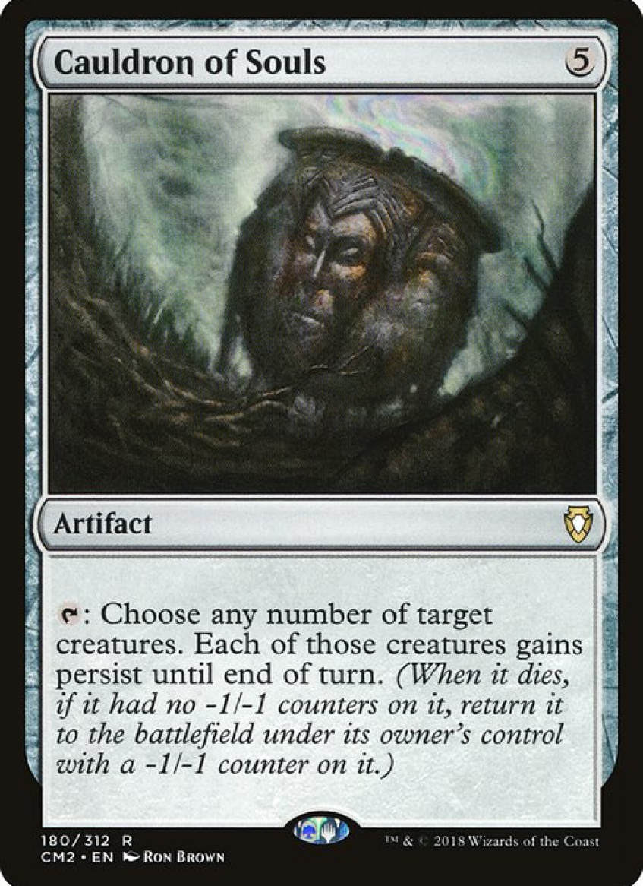
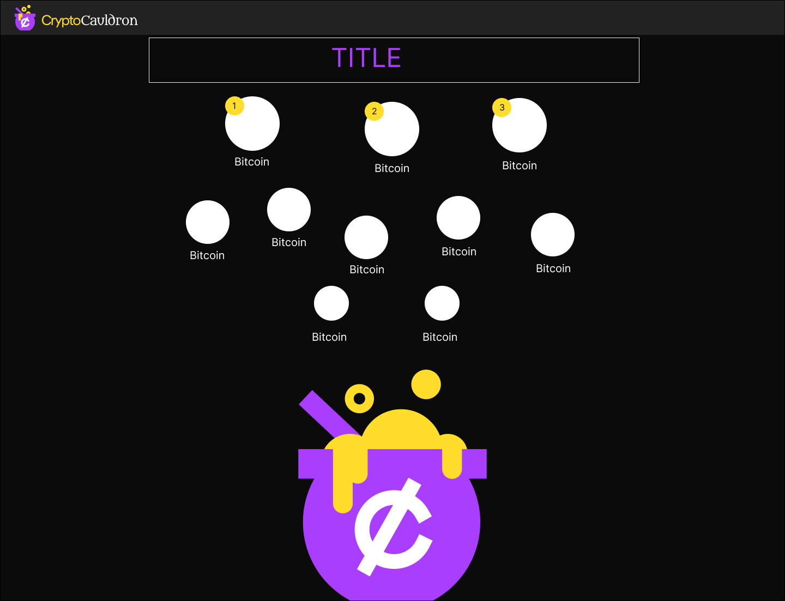
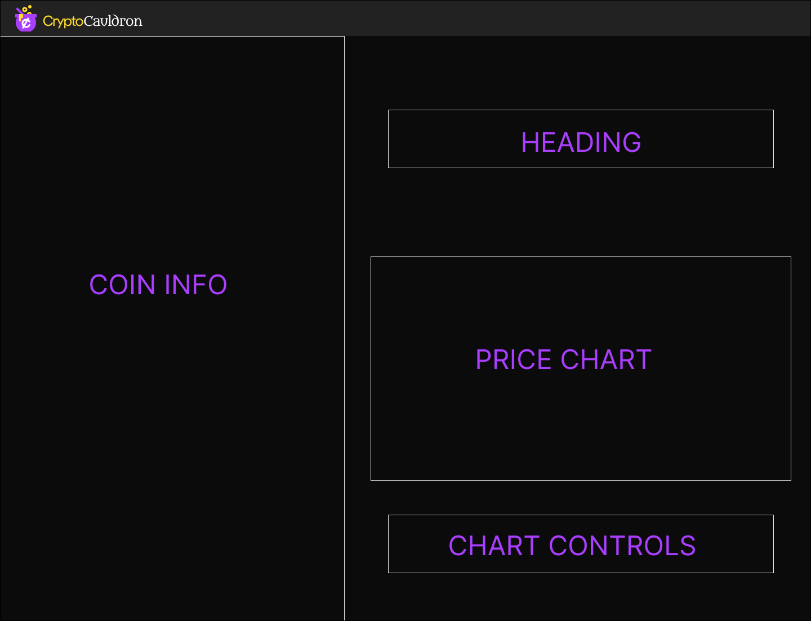

## Accessing the site
Access the app here: https://main--crypto-cauldron.netlify.app/

Responsive on desktop, tablets and mobile

## Features

CryptoCauldron is a front end project that allows users to look up information about crypto-currencies such as price information, price change, volume and trending by volume.

The features include:

Homepage with crypto data table and search/filter functionality (case insensitive).
Trending by Volume page, ranking the top 10 currently trending crypto currencies by volume.
Individual coin pages with information specific to each coin and pricing information based on time and date.
Custom 404 page with nagivation back to Home. (not working on netlify)

Users have the ability to do the following:
Look up an search for coins
Click Trending Coins 
Click rows in the coin table to access further coin information.

## Technologies used

Front end

Reactjs
Typescript
Chartjs
Lottie
Jest
React Testing Library
Axios
Wallaby Js

## Approach taken

Planning
This project was for a job i applied for (AND REALLY WANT TO GET) I was heavily inspired by talking to the product manager and got inspiration form a nerdy conversation about Magic The Gathering. Hence i decided to theme it around the mtg card Cauldron of Souls. I really tried to put my personality and creativity into the project to present information that might be a bit confusing to newer investors in a digestible and interesting way. I wanted to create a delightful experience for users not just an informative one.

The designs were created using figma (designs below) with mobile and desktop view in mind.

Given the scope of the challenge it was not necessary to implement a back end however i did actually play around with the idea of creating firebase authenticated users with individual watchlists. In the future i would like to add this to the app!

## Lessons learnt

Job interview aside, this project was a great learning experience for me to get more practice with Typescript in react and learn Jest and the React Testing Library. I was able to write some basic tests for each componenet. I'll admit i'm not an expert on Typscript and Jest (for now) but i think i learned an incredibly large amout in a very very short amount of time (4 days). The planning definitely helped to build the app in a more structured way. 

## Future improvements and challenges

Implement a backend to create more functionality

Since i'm still quite new to Typescript there were some variable types that i couldn't really wrap my head around. I know it's not really best practice to use the type of "any" when typescript complains but in some situations i just could not debug the code succesfully and had to use it as a last resort. 

I would like to get more experience writing unit tests for components. Most of my testing was to check if axios requests succeeded or failed, if navigation was sucessful and if components were renedered in the DOM. Some aspects i wanted to test but couldn't figure out a way to were:

Testing if the filter search input was actually working on the Home page.

Testing if the chart information was dynamically updating when the timeline buttons were clicked.

It was also difficult to assess if my mock data i used to test each component was accurate enough to portray the functionality of the component.

Some things i tried to tackle but ultimately failed was trying to use the enzyme testing library to bring functions from my components into the test file, and then create a wrapper that would allow me to mock run the function. This didn't work however because a large portion of the enzyme testing library has been deprecated and does not work for functional components. 

I do think i tested the major aspects of each component successfully to the best of my ability, being new to Jest. 

The custom 404 page does not currently work on netlify. Not too sure, why netlify seems to not pick up 404 components. It does work in a dev server but i'm not too sure how to fix it at this stage, there seems to be very little information about this in the netlify docs.

## Conclusion

Overall I had a lot of fun with the front end coding challenge and learning all the various technologies along the way. I hope my passion and creativity showed in the final product as i wanted to really put my personality into the application. I spent a lot of time and effort building this app and i hope you appreciate it! This is only one of many learning experiences on my dev journey cheers!

