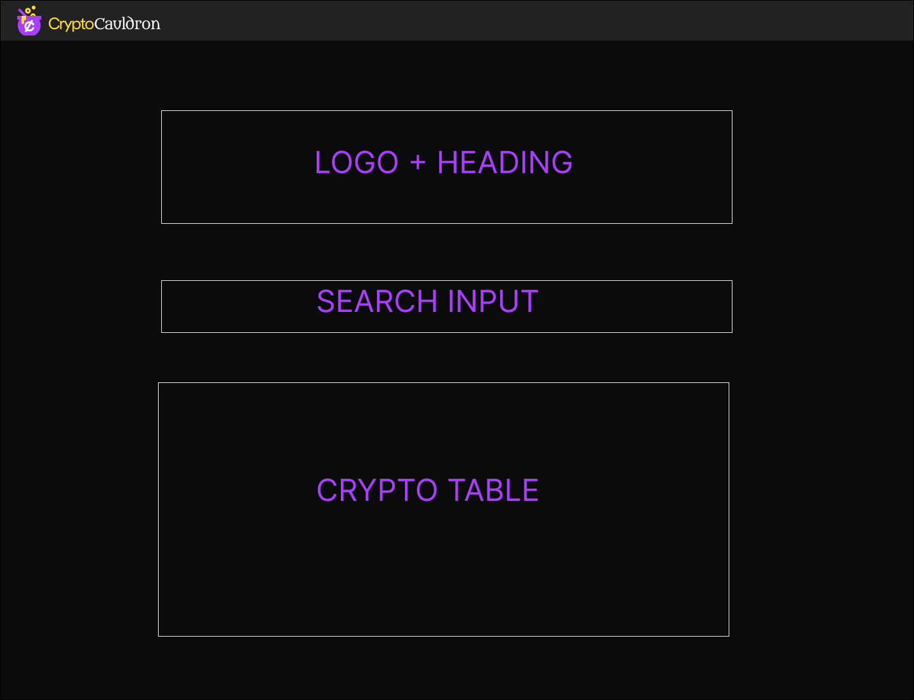

## Accessing the site
Access the app here: [https://ux-colab.web.app/](https://app.netlify.com/sites/crypto-cauldron/overview)

Responsive on desktop, tablets and mobile

## Features

CryptoCauldron is a front end project that allows users to look up information about crypto-currencies such as price information, price change, volume and trending by volume.

The features include:

Homepage with crypto data table and search/filter functionality (case insensitive).
Trending by Volume page, ranking the top 10 currently trending crypto currencies by volume.
Individual coin pages with information specific to each coin and pricing information based on time and date.

Users have the ability to do the following:
Look up an search for coins
Click Trending Coins 
Click rows in the coin table to access further coin information.

## Technologies used

Front end

Reactjs
Typescript
Chartjs
Lottie
Jest
React Testing Library
Axios

## Approach taken

Planning
This project was for a job i applied for (AND REALLY WANT TO GET) I was heavily inspired by talking to the product manager and got inspiration form a nerdy conversation about Magic The Gathering. Hence i decided to theme it around the mtg card

The designs were created by the UX team using figma (designs below) with mobile and desktop view in mind.

Given the short timeframe we did not feel it was necessary to implement a full User Authetication login system with firebase so we opted to save user login data in local storage to allow them to edit their preferences.

## Lessons learnt

To communicate effectively with the UX team and share ideas and determine the scope of the project. It was important to let the designers know what features were difficult to implement in the given timeframe and what features were not.

Pair programming was also very effective, especially using liveshare on VS code to simultaneously work on the project without stepping on each others toes.

## Future improvements

We could not fully implement the dashboard feature due to running out of time, this would need to be improved in the future.

In the future, I would like to add/improve the following:

The dashboard tables are not mobile responsive and no other analytical data is displayed besides just the user information and preferences.

